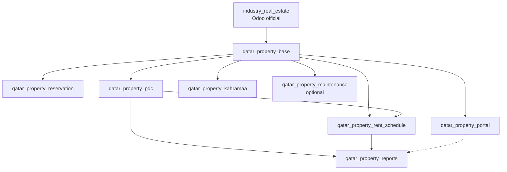

# Module Dependency Map

**Bright Information Systems W.L.L** · Qatar Property Phase 3

---

## Dependency diagram



---

## Linear view

```
industry_real_estate
        ↓
qatar_property_base
        ↓
   ┌────┼────┬────────────┬──────────┐
   ↓    ↓    ↓            ↓          ↓
  res  pdc  rent      kahramaa   portal
   │    │    │
   │    └──→ rent (optional PDC link)
   │         │
   └────┬────┘
        ↓
  qatar_property_reports
        ↓
  qatar_property_maintenance (optional, parallel)
```

---

## Dependency table

| Module | Depends on | Depended on by |
|--------|------------|----------------|
| `industry_real_estate` | Odoo enterprise stack | `qatar_property_base` |
| `qatar_property_base` | `industry_real_estate`, `base`, `contacts`, `account`, `sale` | All custom modules |
| `qatar_property_reservation` | `qatar_property_base` | — |
| `qatar_property_pdc` | `qatar_property_base`, `account` | `qatar_property_rent_schedule`, `qatar_property_reports` |
| `qatar_property_rent_schedule` | `qatar_property_base`, `qatar_property_pdc` *(optional)* | `qatar_property_reports` |
| `qatar_property_reports` | `qatar_property_base`, `qatar_property_pdc`, `qatar_property_rent_schedule` | — |
| `qatar_property_portal` | `qatar_property_base`, `portal`, `website` | — |
| `qatar_property_kahramaa` | `qatar_property_base` | — |
| `qatar_property_maintenance` | `qatar_property_base`, `helpdesk` or `project` | — |

---

## Install order

When installing all modules on a fresh sandbox:

```
1. industry_real_estate          (Odoo official — already installed)
2. qatar_property_base
3. qatar_property_reservation
4. qatar_property_pdc
5. qatar_property_kahramaa
6. qatar_property_rent_schedule
7. qatar_property_reports
8. qatar_property_portal
9. qatar_property_maintenance    (optional)
```

Steps 3–5 may be parallelised after step 2. Steps 6–7 require PDC. Step 8 is independent of reports but benefits from reports for document download.

---

## Odoo `depends` declarations (planned)

### `qatar_property_base`

```python
'depends': [
    'industry_real_estate',
    'contacts',
    'account',
    'sale_subscription',
]
```

### `qatar_property_reservation`

```python
'depends': ['qatar_property_base']
```

### `qatar_property_pdc`

```python
'depends': ['qatar_property_base', 'account']
```

### `qatar_property_rent_schedule`

```python
'depends': ['qatar_property_base', 'qatar_property_pdc']
```

### `qatar_property_reports`

```python
'depends': [
    'qatar_property_base',
    'qatar_property_pdc',
    'qatar_property_rent_schedule',
]
```

### `qatar_property_portal`

```python
'depends': ['qatar_property_base', 'portal', 'website']
```

### `qatar_property_kahramaa`

```python
'depends': ['qatar_property_base']
```

### `qatar_property_maintenance`

```python
'depends': ['qatar_property_base', 'helpdesk']  # or 'project' — TBD
```

---

**Bright Information Systems W.L.L** · June 2026
